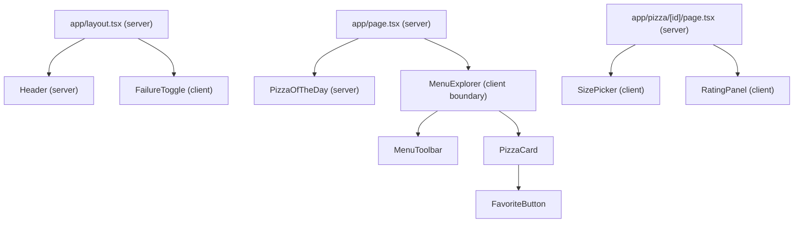

# Analisis Komponen `src/components`

Untuk setiap komponen, dokumen ini menjawab tiga pertanyaan:

1. Apakah komponen ini **Server** atau **Client**?
2. Apa yang dibutuhkannya **dari browser**?
3. Apakah ia **perlu `"use client"` sendiri**?

## Prinsip dasar

`"use client"` menandai **pintu masuk (boundary)** dari server ke client. Ia **bukan** label yang wajib dipasang di setiap komponen client.

- Komponen yang di-import oleh file client **otomatis ikut menjadi client**, walaupun tanpa directive.
- Sebuah komponen **perlu `"use client"` sendiri** hanya jika ia dipakai langsung oleh Server Component **dan** butuh fitur browser (hook, event handler, `window`, `document`).
- Props yang menyeberang dari server ke client harus **serializable**: data, Promise, JSX/`children`, atau Server Action. **Fungsi biasa tidak boleh** dikirim.

## Siapa memakai siapa

## Hasil analisis

| Komponen | 1. Server / Client | 2. Butuh apa dari browser | 3. Perlu `"use client"` sendiri? | Status |
|---|---|---|---|---|
| [Header](src/components/Header.tsx) | **Server** | Tidak ada. `FavoriteCount` adalah fungsi async yang memanggil `getFavoriteIds()` (dari file `server-only`) di dalam `<Suspense>` | ❌ Tidak | ✅ Sudah benar |
| [PizzaOfTheDay](src/components/PizzaOfTheDay.tsx) | **Server** (`"use cache"` + `cacheLife("days")`) | Tidak ada. Tombol Tutup memakai checkbox + CSS `:has`, jadi tidak butuh JavaScript | ❌ Tidak | ⚠️ Ada bug (lihat di bawah) |
| [FailureToggle](src/components/FailureToggle.tsx) | **Client** | `document.cookie`, event `window`, `useSyncExternalStore`, `onChange` | ✅ Ya, karena dipakai langsung oleh `layout.tsx` (server) | ✅ Sudah benar |
| [MenuExplorer](src/components/MenuExplorer.tsx) | **Client** | `useState` untuk query dan kategori | ✅ Ya, karena dipakai oleh `page.tsx` (server). Props-nya (`pizzas` dan sebuah Promise) serializable | ✅ Sudah benar |
| [MenuToolbar](src/components/MenuToolbar.tsx) | **Client** (ikut `MenuExplorer`) | `onChange`, `onClick`, tapi state-nya milik parent | ❌ Tidak. Komponen ini **menerima fungsi** (`onQueryChange`, `onCategoryChange`), jadi tidak boleh dipakai langsung oleh Server Component | 🟡 Directive-nya bisa dihapus |
| [PizzaCard](src/components/PizzaCard.tsx) | **Client** (ikut `MenuExplorer`) | Tidak ada. Isinya hanya `Image`, `Link`, `Suspense`, dan teks, tanpa hook atau event | ❌ Tidak | 🟡 Directive-nya bisa dihapus |
| [FavoriteButton](src/components/FavoriteButton.tsx) | **Client** | `onClick`, `use(promise)`, `useOptimistic`, `useTransition`, `useState` | ✅ Disarankan tetap ada. Kalau `PizzaCard` kelak dipakai dari server, komponen inilah yang menjadi boundary. Props-nya serializable | ✅ Sudah benar |
| [SizePicker](src/components/SizePicker.tsx) | **Client** | `useState`, `onClick` | ✅ Ya, karena dipakai oleh halaman detail (server) | ✅ Sudah benar |
| [RatingPanel](src/components/RatingPanel.tsx) | **Client** | `useOptimistic`, `useState`, `useFormStatus`, `<form action>` | ✅ Ya, karena dipakai oleh halaman detail (server). `ratePizzaAction` adalah Server Action yang di-import di sisi client, bukan fungsi yang dikirim sebagai prop | ✅ Sudah benar |
| [PizzaDetail](src/components/PizzaDetail.tsx) | Tidak berlaku | Tidak berlaku. Seluruh isinya di-comment dan sudah digantikan oleh `app/pizza/[id]/page.tsx` | Tidak berlaku | 🗑️ File mati, sebaiknya dihapus |

## Catatan

### 1. `MenuToolbar` dan `PizzaCard`: `"use client"` yang tidak diperlukan

Kalau directive-nya dihapus, perilakunya **tidak berubah**, karena keduanya tetap menjadi client lewat `MenuExplorer`. Manfaat menghapusnya:

- Lebih jelas di mana boundary sebenarnya, yaitu hanya di `MenuExplorer`.
- `MenuToolbar` menerima prop berupa fungsi. Kalau ia berlabel `"use client"`, seolah-olah boleh dipakai dari Server Component, padahal itu akan melanggar aturan "tidak ada fungsi dari server ke client". Plugin TypeScript Next.js juga biasanya memberi peringatan *"props must be serializable"* untuk file seperti ini.

### 2. Bug di `PizzaOfTheDay`

| Masalah | Akibat | Perbaikan |
|---|---|---|
| Tidak ada `<input type="checkbox" id="pizza-of-the-day">` | `htmlFor` tidak menunjuk elemen apa pun dan `has-[:checked]` tidak pernah aktif, jadi **Tutup tidak berfungsi** | Tambahkan `<input id="pizza-of-the-day" type="checkbox" className="sr-only" />` di dalam `<aside>` |
| Label memakai `absolute inset-0` | Label menutupi seluruh banner, jadi **link nama pizza tidak bisa diklik**. Klik di mana pun akan menutup banner | Kecilkan label menjadi tombol pojok, misalnya `absolute right-4 top-4 …` |
| `text-pacifico` | Class ini tidak ada di Tailwind, kecuali sudah didefinisikan di `globals.css` | Cek `globals.css`, atau pakai class yang memang ada |

### 3. Langkah berikutnya (opsional)

Pola umumnya: **semakin banyak komponen yang tetap di server, semakin sedikit JavaScript yang dikirim ke browser.**

`PizzaCard` adalah kandidat berikutnya. Isinya murni tampilan, dan satu-satunya bagian interaktif (`FavoriteButton`) sudah punya `"use client"` sendiri. Untuk menjadikannya benar-benar server, list kartunya harus di-render dari server, lalu filter dari `MenuExplorer` mengatur kartu mana yang terlihat. Itu perubahan arsitektur yang lebih besar.

## Ringkasan cepat

| Wajib `"use client"` sendiri | Client tanpa perlu directive | Server |
|---|---|---|
| FailureToggle, MenuExplorer, SizePicker, RatingPanel, FavoriteButton (disarankan) | MenuToolbar, PizzaCard | Header, PizzaOfTheDay |
